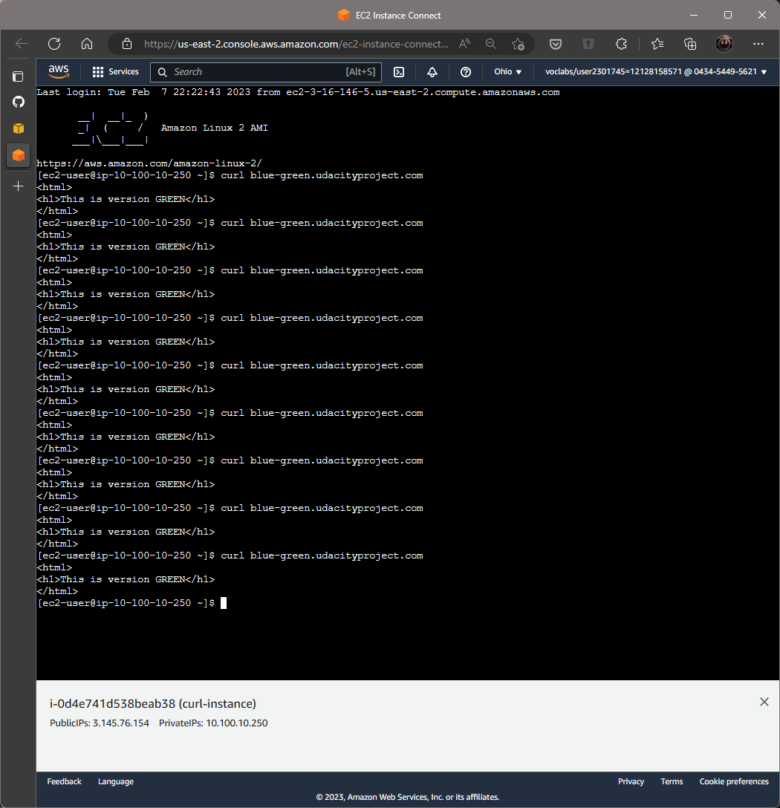

## Deploy the green service

```bash
Stephane@Surface-de-Stef MINGW64 ~/OneDrive/Documents/Udacity SRE/Project 3/nd087-c3-deployment-roulette (main)
$ ./blue-green.sh
configmap/green-config unchanged
deployment.apps/green created
Waiting for deployment "green" rollout to finish: 2 of 3 updated replicas are available...
deployment "green" successfully rolled out

Stephane@Surface-de-Stef MINGW64 ~/OneDrive/Documents/Udacity SRE/Project 3/nd087-c3-deployment-roulette (main)
$ kubectl get pods --all-namespaces
NAMESPACE     NAME                           READY   STATUS    RESTARTS   AGE
kube-system   aws-node-p2w69                 1/1     Running   0          122m
kube-system   aws-node-sxkck                 1/1     Running   0          122m
kube-system   coredns-f47955f89-22sfw        1/1     Running   0          127m
kube-system   coredns-f47955f89-kvlzj        1/1     Running   0          127m
kube-system   kube-proxy-mdc7k               1/1     Running   0          122m
kube-system   kube-proxy-spp7s               1/1     Running   0          122m
udacity       blue-8475cbdf46-8cmmx          1/1     Running   0          117s
udacity       blue-8475cbdf46-hhvr4          1/1     Running   0          117s
udacity       blue-8475cbdf46-rkzn7          1/1     Running   0          117s
udacity       canary-v1-64598c676f-fm5hb     1/1     Running   0          117m
udacity       canary-v1-64598c676f-jcvfs     1/1     Running   0          44m
udacity       canary-v2-5dc9c56687-h4lql     1/1     Running   0          54s
udacity       canary-v2-5dc9c56687-mvk8z     1/1     Running   0          35m
udacity       green-5cdd96c9b4-28xgt         1/1     Running   0          32s
udacity       green-5cdd96c9b4-59wq6         1/1     Running   0          32s
udacity       green-5cdd96c9b4-b2pg7         1/1     Running   0          32s
udacity       hello-world-794458d64d-n5gzj   1/1     Running   0          76m
```

## Curl the service on Route53 CNAME


## Destroy blue service and deployment

```bash
Stephane@Surface-de-Stef MINGW64 ~/OneDrive/Documents/Udacity SRE/Project 3/nd087-c3-deployment-roulette (main)
$ kubectl delete svc blue-svc
service "blue-svc" deleted

Stephane@Surface-de-Stef MINGW64 ~/OneDrive/Documents/Udacity SRE/Project 3/nd087-c3-deployment-roulette (main)
$ kubectl delete deployment blue
deployment.apps "blue" deleted
```

Destroying also the DNS entry from Route53 (in AWS Console)

## Curl the service on Route53 CNAME after blue is destroyed

