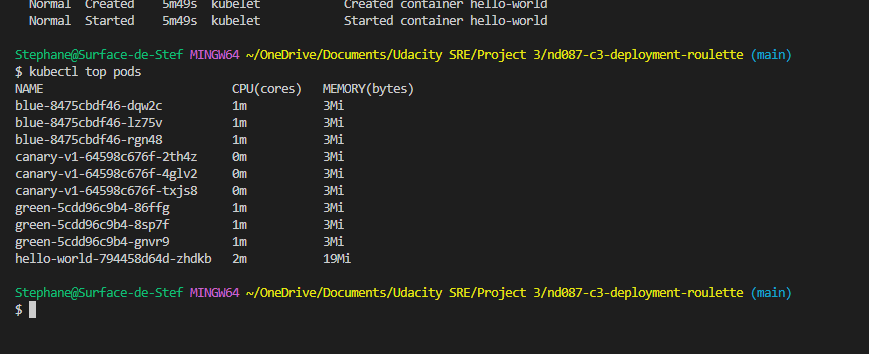
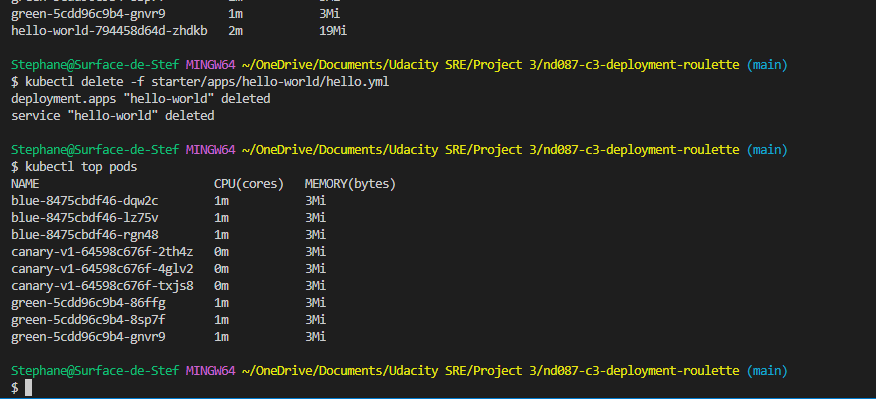

## Install a metrics server

```bash
Stephane@Surface-de-Stef MINGW64 ~/OneDrive/Documents/Udacity SRE/Project 3/nd087-c3-deployment-roulette (main)
$ kubectl apply -f starter/infra/metrics-server.yml
serviceaccount/metrics-server created
clusterrole.rbac.authorization.k8s.io/system:aggregated-metrics-reader created
clusterrole.rbac.authorization.k8s.io/system:metrics-server created
rolebinding.rbac.authorization.k8s.io/metrics-server-auth-reader created
clusterrolebinding.rbac.authorization.k8s.io/metrics-server:system:auth-delegator created
clusterrolebinding.rbac.authorization.k8s.io/system:metrics-server created
service/metrics-server created
deployment.apps/metrics-server created
apiservice.apiregistration.k8s.io/v1beta1.metrics.k8s.io created

Stephane@Surface-de-Stef MINGW64 ~/OneDrive/Documents/Udacity SRE/Project 3/nd087-c3-deployment-roulette (main)
$ kubectl get deployments --namespace kube-system
NAME                 READY   UP-TO-DATE   AVAILABLE   AGE
cluster-autoscaler   1/1     1            1           2m18s
coredns              2/2     2            2           23m
metrics-server       1/1     1            1           87s

Stephane@Surface-de-Stef MINGW64 ~/OneDrive/Documents/Udacity SRE/Project 3/nd087-c3-deployment-roulette (main)
$ kubectl get pods --namespace kube-system
NAME                                 READY   STATUS    RESTARTS   AGE
aws-node-htbdt                       1/1     Running   0          19m
aws-node-t9cbg                       1/1     Running   0          19m
cluster-autoscaler-d8cc67649-vjxzj   1/1     Running   0          2m26s
coredns-f47955f89-554v6              1/1     Running   0          23m
coredns-f47955f89-sgz84              1/1     Running   0          23m
kube-proxy-hrwh9                     1/1     Running   0          19m
kube-proxy-tp9wm                     1/1     Running   0          19m
metrics-server-79ff596794-wtrrq      1/1     Running   0          95s
```

## Display output of the metrics command

```bash
Stephane@Surface-de-Stef MINGW64 ~/OneDrive/Documents/Udacity SRE/Project 3/nd087-c3-deployment-roulette (main)
$ kubectl top pods
NAME                           CPU(cores)   MEMORY(bytes)
blue-8475cbdf46-dqw2c          1m           3Mi
blue-8475cbdf46-lz75v          1m           3Mi
blue-8475cbdf46-rgn48          1m           3Mi
canary-v1-64598c676f-2th4z     0m           3Mi
canary-v1-64598c676f-4glv2     0m           3Mi
canary-v1-64598c676f-txjs8     0m           3Mi
green-5cdd96c9b4-86ffg         1m           3Mi
green-5cdd96c9b4-8sp7f         1m           3Mi
green-5cdd96c9b4-gnvr9         1m           3Mi
hello-world-794458d64d-zhdkb   2m           19Mi
```




## Delete the service consuming most memory

```bash
Stephane@Surface-de-Stef MINGW64 ~/OneDrive/Documents/Udacity SRE/Project 3/nd087-c3-deployment-roulette (main)
$ kubectl delete -f starter/apps/hello-world/hello.yml
deployment.apps "hello-world" deleted
service "hello-world" deleted
```

## Display output of the metrics command

```bash
Stephane@Surface-de-Stef MINGW64 ~/OneDrive/Documents/Udacity SRE/Project 3/nd087-c3-deployment-roulette (main)
$ kubectl top pods
NAME                         CPU(cores)   MEMORY(bytes)
blue-8475cbdf46-dqw2c        1m           3Mi
blue-8475cbdf46-lz75v        1m           3Mi
blue-8475cbdf46-rgn48        1m           3Mi
canary-v1-64598c676f-2th4z   0m           3Mi
canary-v1-64598c676f-4glv2   0m           3Mi
canary-v1-64598c676f-txjs8   0m           3Mi
green-5cdd96c9b4-86ffg       1m           3Mi
green-5cdd96c9b4-8sp7f       1m           3Mi
green-5cdd96c9b4-gnvr9       1m           3Mi
```

